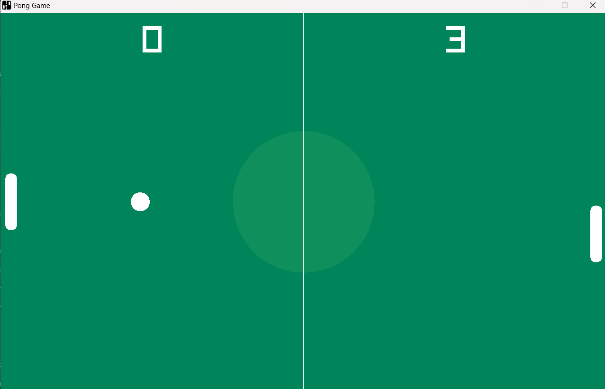

# Pong Game – Built with C++ and Raylib

A modern C++ implementation of the classic Pong game, built with object-oriented design and powered by [raylib](https://www.raylib.com/).

<p align="center">
  
</p>

## Motivation

Practice my C++ programming skills and try raylib for making simple games.

## Prerequisites

1. Install [raylib](https://www.raylib.com/)
2. Install [CMake](https://cmake.org/)

## Compiling
### Manual Build (Desktop)

1. Clone the repository:
   ```bash
   git clone https://github.com/RacsoZu/Cpp_PongGame_Raylib.git
   cd Cpp_PongGame_Raylib
   ```
2. Create a build directory and navigate into it:
   ```bash
   mkdir build && cd build
   ```

3. Generate the build files with CMake:
   ```bash
   cmake ..
   ```

4. Compile the project:
   ```bash
   cmake --build .
   ```


## License

The game is available as open source under the terms of the [MIT License](https://opensource.org/licenses/MIT).
